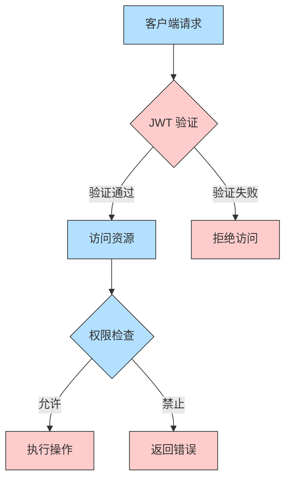

<div align="center">
  
  <h1 align="center" style="width: 100%; text-align: center;">
    &nbsp;设备监控系统&nbsp;
  </h1>
  <p align="center">
    
    
    
    
  </p>

  <p align="center">
    
    
    
    
  </p>
  <p align="center">
    <kbd>
      
    </kbd>
    <kbd>
      
    </kbd>
    <kbd>
      
    </kbd>
    <kbd>
      
    </kbd>
  </p>
<div align="center">
  <p>这是一个基于 Electron 和 WebSocket 的设备监控系统，包含客户端和服务器端两个部分。</p>
  <p>系统可以实时监控设备状态、网络连接情况，并提供远程 WiFi 管理功能。</p>
</div>

<hr style="border: 1px solid #eee; margin: 30px 0;"/>

[TOC]

##  系统架构

<div align="center">
  
  <br/>

  ```mermaid
  graph TB
      subgraph 客户端[客户端 ET]
          A1[Electron 主进程] --> B1[系统托盘]
          A1 --> B2[WebSocket 客户端]
          A1 --> B3[设备信息采集]
          A1 --> B4[WiFi 管理]
          B3 --> C1[序列号]
          B3 --> C2[网络接口]
          B3 --> C3[WiFi 状态]
          
          style A1 fill:#3498db,stroke:#2980b9,color:#fff
          style B1 fill:#2ecc71,stroke:#27ae60,color:#fff
          style B2 fill:#2ecc71,stroke:#27ae60,color:#fff
          style B3 fill:#2ecc71,stroke:#27ae60,color:#fff
          style B4 fill:#2ecc71,stroke:#27ae60,color:#fff
          style C1 fill:#e74c3c,stroke:#c0392b,color:#fff
          style C2 fill:#e74c3c,stroke:#c0392b,color:#fff
          style C3 fill:#e74c3c,stroke:#c0392b,color:#fff
      end

      subgraph 服务器[服务器端 ET-SERVER]
          D1[Express 服务器] --> E1[WebSocket 服务器]
          D1 --> E2[MongoDB 数据库]
          D1 --> E3[RESTful API]
          D1 --> E4[认证系统]
          E1 --> F1[设备连接管理]
          E1 --> F2[实时状态更新]
          E2 --> F3[设备信息存储]
          E3 --> F4[设备管理接口]
          
          style D1 fill:#9b59b6,stroke:#8e44ad,color:#fff
          style E1 fill:#f1c40f,stroke:#f39c12,color:#fff
          style E2 fill:#f1c40f,stroke:#f39c12,color:#fff
          style E3 fill:#f1c40f,stroke:#f39c12,color:#fff
          style E4 fill:#f1c40f,stroke:#f39c12,color:#fff
          style F1 fill:#1abc9c,stroke:#16a085,color:#fff
          style F2 fill:#1abc9c,stroke:#16a085,color:#fff
          style F3 fill:#1abc9c,stroke:#16a085,color:#fff
          style F4 fill:#1abc9c,stroke:#16a085,color:#fff
      end

      B2 <--> E1
      
      style 客户端 fill:#ecf0f1,stroke:#bdc3c7
      style 服务器 fill:#ecf0f1,stroke:#bdc3c7
  ```
##  技术栈

###  客户端
-  Electron 28.0.0
-  TypeScript 5.7.3
-  WebSocket (ws)
-  Windows Native API

###  服务器端  
-  Node.js 14+
-  Express 4.21.2
-  MongoDB 4.4+
-  WebSocket (ws)
-  JWT 认证

##  核心功能实现

### 客户端功能实现

```typescript
// 设备信息采集
async function getDeviceInfo() {
  // 获取序列号
  const { stdout } = await execAsync('wmic bios get serialnumber');
  const serialNumber = stdout.split('\n')[1]?.trim() || '未知';

  // 获取网络信息
  const networkInfo = await getNetworkInfo();
  
  return {
    serialNumber,
    networkInfo,
    platform: process.platform
  };
}

// WiFi 管理
async function handleWiFiDisconnect() {
  const { stdout } = await execAsync('netsh wlan show interfaces');
  const ssid = // 解析 SSID
  await execAsync('netsh wlan disconnect');
  await execAsync(`netsh wlan delete profile name="${ssid}"`);
}
```

### 服务器端实现

```typescript
// WebSocket 连接管理
wss.on('connection', (ws) => {
  ws.on('message', async (data) => {
    const { type, data: deviceInfo } = JSON.parse(data);
    if (type === 'device_info') {
      await Device.findOneAndUpdate(
        { serialNumber: deviceInfo.serialNumber },
        { 
          $set: {
            networkInfo: deviceInfo.networkInfo,
            lastSeen: new Date(),
            isOnline: true
          }
        },
        { upsert: true }
      );
    }
  });
});

// 设备状态更新
const updateDeviceStatuses = async () => {
  const thirtySecondsAgo = new Date(Date.now() - 30000);
  await Device.updateMany(
    { lastSeen: { $lt: thirtySecondsAgo } },
    { $set: { isOnline: false } }
  );
};
```

##  系统特性

<div align="center">
  <table>
    <tr>
      <th> 特性</th>
      <th> 描述</th>
    </tr>
    <tr>
      <td>🔒 安全认证</td>
      <td>基于 JWT 的身份验证和授权</td>
    </tr>
    <tr>
      <td>🔄 实时监控</td>
      <td>WebSocket 实现设备状态实时更新</td>
    </tr>
    <tr>
      <td>📡 网络管理</td>
      <td>远程 WiFi 配置和管理功能</td>
    </tr>
    <tr>
      <td>💾 数据持久化</td>
      <td>MongoDB 存储设备信息和历史记录</td>
    </tr>
  </table>
</div>

##  安全性设计



## 📈 性能优化

### 客户端优化
- 使用 TypeScript 提升代码质量
- 实现单实例锁防止重复启动
- 资源使用优化和内存管理
- 自动重连机制

### 服务器端优化
- 数据库索引优化
- 连接池管理
- 错误处理和日志记录
- 定时清理离线设备

##  部署指南

### 环境要求
<div align="center">
  <table>
    <tr>
      <th>组件</th>
      <th>最低要求</th>
      <th>推荐配置</th>
    </tr>
    <tr>
      <td>操作系统</td>
      <td>Windows 10</td>
      <td>Windows 10/11</td>
    </tr>
    <tr>
      <td>Node.js</td>
      <td>14.x</td>
      <td>16.x 或更高</td>
    </tr>
    <tr>
      <td>MongoDB</td>
      <td>4.4</td>
      <td>5.0 或更高</td>
    </tr>
    <tr>
      <td>内存</td>
      <td>4GB</td>
      <td>8GB 或更高</td>
    </tr>
  </table>
</div>

### 配置说明

#### 1. 数据库配置
在 `et-server/src/config/database.ts` 文件中配置您的 MySQL连接信息：

```typescript
export const dbConfig = {
    host: 'your-mongodb-host',     // MongoDB 服务器地址
    port: 3307,                    // MongoDB 端口
    user: 'your-username',         // 数据库用户名
    password: 'your-password',     // 数据库密码
    database: 'your-database',     // 数据库名称
    // ... 其他配置保持不变
};
```


#### 2. 服务器配置
创建 `et-server/src/config/server.ts` 文件：

```typescript
export const serverConfig = {
    port: 3000,                    // 服务器端口
    jwtSecret: 'your-jwt-secret',  // JWT 密钥
    corsOrigin: '*',               // CORS 配置
    wsPort: 8080                   // WebSocket 端口
};
```

#### 3. 客户端配置
在 `et/src/config/app.ts` 中配置服务器连接信息：

```typescript
export const appConfig = {
    serverUrl: 'http://your-server-ip:3000',
    wsUrl: 'ws://your-server-ip:8080',
    // ... 其他配置
};
```


### 部署步骤

#### 服务器端部署

1. 安装 MongoDB
```bash
# Ubuntu/Debian
sudo apt update
sudo apt install -y mongodb

# CentOS
sudo yum install -y mongodb-org
```

2. 启动 MongoDB 服务
```bash
sudo systemctl start mongod
sudo systemctl enable mongod
```


3. 部署服务器应用
```bash
cd et-server

# 安装依赖
npm install

# 编译 TypeScript
npm run build

# 使用 PM2 启动服务
npm install -g pm2
pm2 start dist/app.js --name et-server
```


#### 客户端部署

1. 安装依赖并构建
```bash
cd et
npm install
npm run build
```

2. 打包应用
```bash
# Windows
npm run package:win

# macOS
npm run package:mac
```


### 防火墙配置

确保以下端口已开放：
- 3000: REST API
- 8080: WebSocket
- 3307: MySQL

```bash
# Ubuntu/Debian
sudo ufw allow 3000
sudo ufw allow 8080
sudo ufw allow 3307

# CentOS
sudo firewall-cmd --permanent --add-port=3000/tcp
sudo firewall-cmd --permanent --add-port=8080/tcp
sudo firewall-cmd --permanent --add-port=3307/tcp
sudo firewall-cmd --reload
```


### 验证部署

1. 检查服务器状态
```bash
curl http://your-server-ip:3000/health
```

2. 检查 WebSocket 连接
```bash
wscat -c ws://your-server-ip:8080
```


##  开发规范

### Git 提交规范
<div align="center">
  <table>
    <tr>
      <th>类型</th>
      <th>说明</th>
    </tr>
    <tr>
      <td>🎯 feat</td>
      <td>新功能</td>
    </tr>
    <tr>
      <td>🐛 fix</td>
      <td>修复问题</td>
    </tr>
    <tr>
      <td>📚 docs</td>
      <td>文档更新</td>
    </tr>
    <tr>
      <td>🎨 style</td>
      <td>代码格式</td>
    </tr>
    <tr>
      <td>♻️ refactor</td>
      <td>代码重构</td>
    </tr>
    <tr>
      <td>✅ test</td>
      <td>测试相关</td>
    </tr>
    <tr>
      <td>🔧 chore</td>
      <td>构建/工具</td>
    </tr>
  </table>
</div>

##  更新日志

<div align="center">
  

  ### v1.0.0 (2024-01-20)
  - ✨ 初始版本发布
  - 🔒 完善认证系统
  - 🔧 优化设备管理
  - 📡 增强网络功能

##  贡献指南

1. Fork 项目
2. 创建特性分支
3. 提交更改
4. 推送到分支
5. 创建 Pull Request

## 📄 许可证

<div align="center">
  
</div>

---

<div align="center">
  
  
  
  
  
  

  <sub>
    
    Built with ❤️ by zgs3344 
  </sub>

